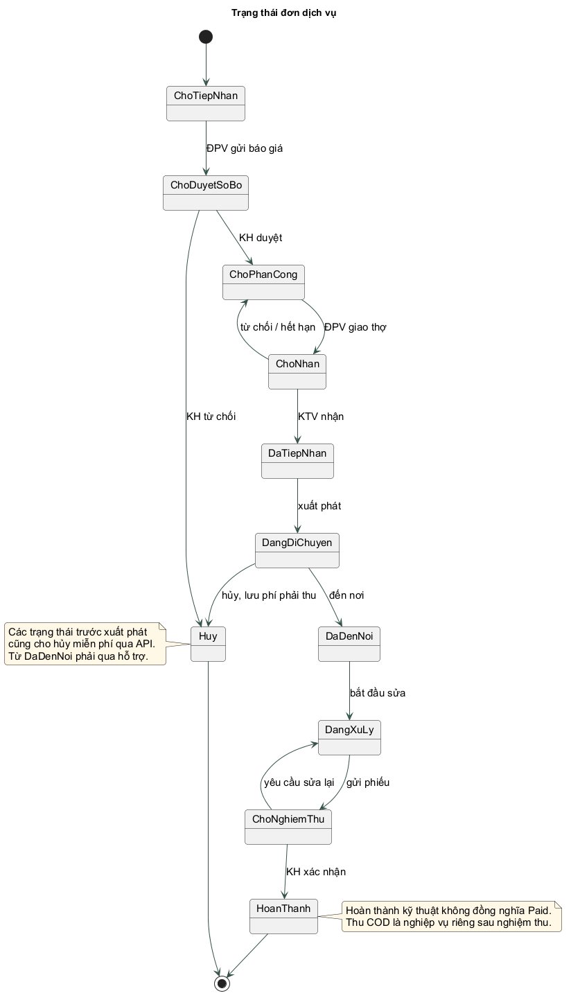
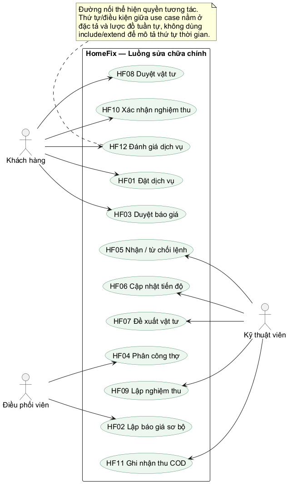
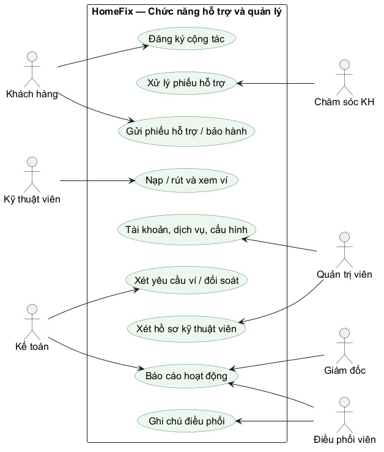
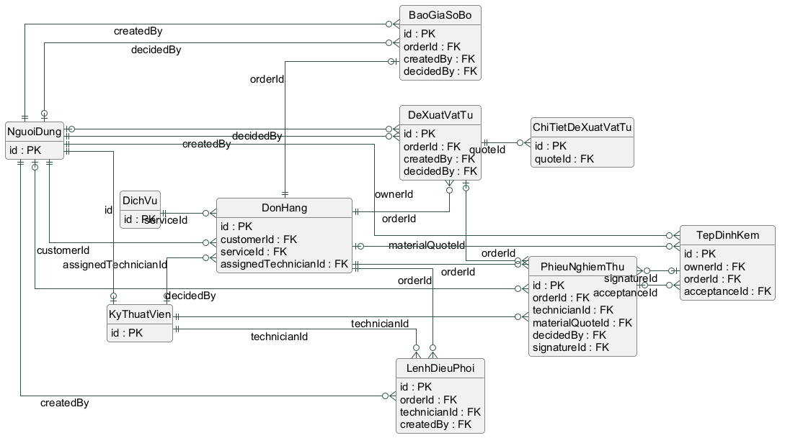
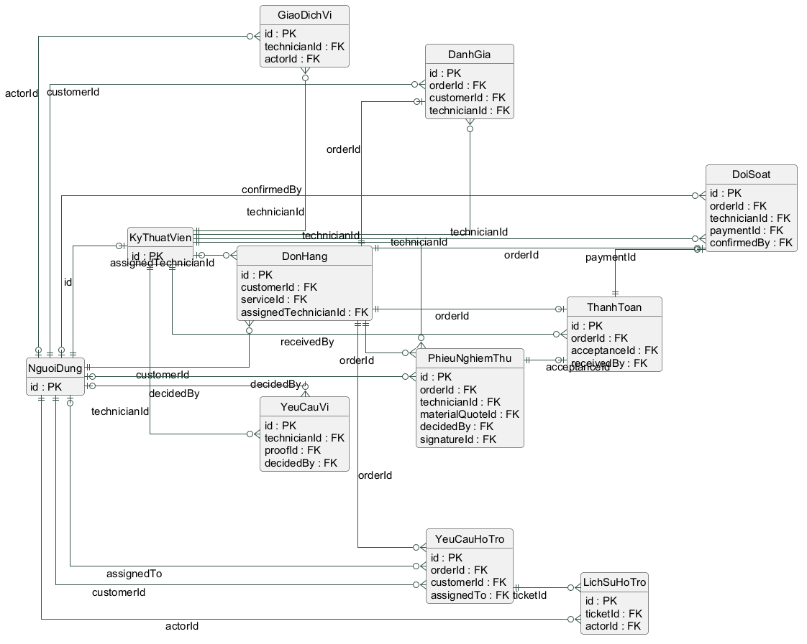
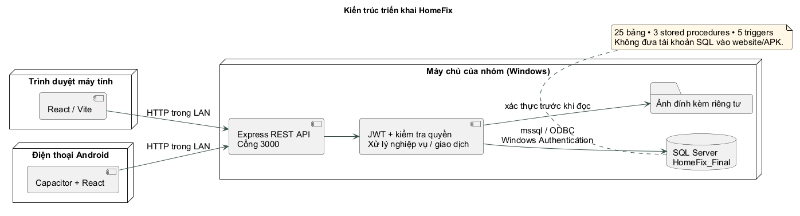

# Chương 1. KHẢO SÁT HIỆN TRẠNG VÀ XÁC ĐỊNH YÊU CẦU

## 1.1. Bối cảnh và vấn đề cần giải quyết

HomeFix là hệ thống quản lý dịch vụ sửa chữa và bảo trì thiết bị tại nhà. Đối tượng phục vụ gồm khách hàng có thiết bị cần xử lý, kỹ thuật viên thực hiện công việc và các bộ phận điều phối, chăm sóc khách hàng, kế toán, quản trị, giám đốc. Đề tài được giới hạn ở mô hình đồ án có thể cài và trình diễn trên máy Windows của nhóm, có website cho máy tính và ứng dụng Android dùng chung dữ liệu.

Trong quy trình liên hệ thợ qua điện thoại hoặc tin nhắn, thông tin địa chỉ, lỗi thiết bị, báo giá, vật tư và kết quả thường nằm ở nhiều nơi. Khi thay người điều phối, nhóm khó biết khách đã duyệt khoản nào, ai đang giữ đơn, tiền đã thu hay chưa. HomeFix tập trung hồ sơ đơn và tách rõ ba quá trình: thực hiện dịch vụ, xác nhận thanh toán, đối soát hoa hồng.

Nguồn khảo sát là báo cáo thiết kế của nhóm, tài liệu môn học, các màn hình Figma được đưa vào báo cáo và kế hoạch code/test đã cung cấp. Bản hoàn thiện này không bổ sung số liệu phỏng vấn hoặc khảo sát thị trường chưa được thực hiện. Các nhận định về nghiệp vụ được dùng làm giả định thiết kế và được kiểm tra qua kịch bản hệ thống.

## 1.2. Kế thừa khảo sát trong báo cáo gốc

Báo cáo gốc đã khảo sát 1Fix và FixMe để tham khảo cách trình bày dịch vụ, đặt yêu cầu, báo giá và kết nối thợ. Bản này kế thừa bài học về minh bạch chi phí, theo dõi trạng thái và lịch sử phục vụ. Các mô tả chức năng đối thủ trong hồ sơ gốc phản ánh thời điểm khảo sát của nhóm, không được xem là đánh giá hiện tại về toàn bộ sản phẩm của doanh nghiệp.

| Vấn đề của quy trình phân tán | Yêu cầu đưa vào HomeFix | Cách kiểm chứng |
|---|---|---|
| Không rõ khách đã đồng ý chi phí nào | Báo giá sơ bộ và vật tư có quyết định riêng | KH khác không duyệt được; lưu phiên bản và thời gian |
| Hai người cùng giao một thợ | Một lệnh/ca hoạt động cho mỗi thợ | Hai lệnh đồng thời chỉ một thành công |
| Thợ không trả lời nhưng đơn vẫn bị giữ | Lệnh có hạn phản hồi, tự trả đơn | Kiểm thử nhận trễ và tác vụ quét hết hạn |
| Hoàn thành sửa bị hiểu là đã thu tiền | Đơn HoanThanh tách thanh toán Paid | Chặn đánh giá trước khi có biên nhận COD |
| Nhấn thu tiền/đối soát nhiều lần | Khóa duy nhất và khóa idempotency | Chỉ một biên nhận, một bút toán hoa hồng |
| Khó kiểm tra sau khiếu nại | Ảnh, lịch sử đơn, phiếu và ghi chú | CSKH truy xuất hồ sơ, ghi kết quả giải quyết |

## 1.3. Phạm vi cài đặt và giả định

Phạm vi cốt lõi là luồng đặt dịch vụ → báo giá sơ bộ → khách duyệt → điều phối → nhận việc → cập nhật tiến độ → duyệt vật tư → nghiệm thu → thu COD → đối soát → đánh giá. Các chức năng quản trị người dùng/dịch vụ/cấu hình, ví kỹ thuật viên, hỗ trợ, thông báo, hồ sơ cộng tác và báo cáo được cài ở mức phù hợp đồ án.

Mỗi tài khoản có một vai trò tại một thời điểm; mỗi đơn xử lý một thiết bị thuộc một dịch vụ. Mỗi thợ có một nhóm chuyên môn chính, chỉ giữ một lệnh hoặc ca hoạt động. Điều phối viên chọn thợ thủ công theo chuyên môn, khu vực hiển thị và khả năng nhận việc; hệ thống không tối ưu tuyến đường, tự ghép thợ hoặc xếp nhiều lịch trong ngày cho một thợ.

Lịch hẹn theo múi giờ Việt Nam trong 30 ngày, từ 08:00 đến 17:30, khung 30 phút, đặt trước ít nhất 30 phút; để trống là cần phục vụ sớm nhất. Cơ sở dữ liệu lưu thời gian UTC và giao diện đổi sang giờ người dùng. Khu vực thực hành chính là TP.HCM. Địa chỉ được lưu dạng chuỗi có số nhà/đường/phường/thành phố, không tích hợp cơ sở dữ liệu hành chính hoặc geocoding.

Ứng dụng cần mạng tới backend. GPS chỉ cập nhật khi người dùng bấm và cấp quyền; không chạy nền. SMS/OTP quên mật khẩu, video call, thanh toán trực tuyến, tự tạo ca bảo hành, tự thu phí hủy và bản iOS là hướng phát triển, không phải kết quả đã cài. Các hình thiết kế gốc mô tả những ý tưởng này được giữ để đối chiếu, có phân biệt với màn hình phần mềm thực tế.

## 1.4. Yêu cầu chức năng theo tác nhân

| Tác nhân | Chức năng đã cài | Giới hạn quyền quan trọng |
|---|---|---|
| Khách hàng (KH) | Đăng ký/đăng nhập, hồ sơ, đặt/hủy đơn, xem tiến độ, duyệt giá/vật tư/nghiệm thu, đánh giá, gửi hỗ trợ, đăng ký cộng tác | Chỉ thao tác đơn của mình; không xác nhận thu COD |
| Kỹ thuật viên (KTV) | Bật sẵn sàng, nhận/từ chối, cập nhật tiến độ/vị trí, đề xuất vật tư, lập nghiệm thu, ghi nhận COD, nạp/rút ví | Chỉ xử lý ca được giao; không nghiệm thu thay khách |
| Điều phối viên (ĐPV) | Xem đơn, chẩn đoán qua ảnh/trao đổi điện thoại, lập báo giá, phân công, ghi chú, theo dõi | Không duyệt báo giá thay KH hoặc ghi nhận đã thu COD |
| Chăm sóc khách hàng (CSKH) | Tra cứu đơn, phiếu khiếu nại/bảo hành, lịch sử và kết quả xử lý | Không sửa chi phí hoặc thu tiền thay thợ |
| Kế toán (KT) | Xem biên nhận, đối soát, xét nạp/rút, báo cáo/CSV | Không xem ảnh hiện trường; không tự tạo biên nhận COD |
| Quản trị viên (ADMIN) | Tài khoản, dịch vụ, cấu hình, duyệt hồ sơ thợ, nhật ký | Không là người thực hiện nghiệp vụ tài chính; không khóa quản trị cuối cùng |
| Giám đốc (GD) | Báo cáo hoạt động, chất lượng thợ, giá trị thu và hoa hồng | Chỉ xem báo cáo; không thao tác đơn chi tiết |

## 1.5. Yêu cầu chất lượng và tiêu chí nghiệm thu

Tính đúng đắn được ưu tiên qua kiểm tra trạng thái, quyền sở hữu, số dư và công thức tiền tại backend/SQL. Giao diện hiển thị tiếng Việt, thông báo lỗi có hướng xử lý, sử dụng được trên màn hình máy tính và điện thoại. Tiền được tính bằng decimal trong SQL; frontend chỉ định dạng và gửi dữ liệu đầu vào, không quyết định tổng tiền cuối.

Mật khẩu được băm bcrypt; API dùng JWT có hạn, kiểm tra trạng thái tài khoản và phiên bản token từ database. Truy vấn truyền tham số; ảnh được kiểm tra nội dung thực, đổi sang JPEG và không phục vụ bằng thư mục công khai. Các lệnh tài chính có khóa chống lặp, dữ liệu cập nhật có rowversion để phát hiện hai người cùng thao tác. Bản LAN dùng HTTP để thuận tiện thực hành; yêu cầu triển khai Internet phải bổ sung HTTPS và vận hành an toàn như Chương 7.

Tiêu chí nghiệm thu bản đồ án là chạy được luồng hoàn chỉnh trên dữ liệu SQL, đủ bảy vai trò, vượt qua bộ kiểm thử thực thi, có APK biên dịch được, báo cáo và hướng dẫn cài đặt đi kèm. Chưa có phép đo chịu tải hoặc chứng nhận an toàn vận hành thương mại.

# Chương 2. PHÂN TÍCH VÀ MÔ HÌNH HÓA YÊU CẦU

## 2.1. Mô hình nghiệp vụ

Khách chọn dịch vụ, cung cấp tình trạng và địa chỉ. Điều phối viên xem thông tin, trao đổi bổ sung và gửi báo giá lấy từ danh mục. Khi khách đồng ý, điều phối viên chọn thợ phù hợp. Thợ phản hồi trong thời hạn; nếu nhận thì đơn đi qua các bước di chuyển, đến nơi và xử lý. Vật tư phát sinh cần khách duyệt trước khi tính vào nghiệm thu.

Thợ gửi nguyên nhân, biện pháp và ảnh nghiệm thu. Khách kiểm tra kết quả: đồng ý thì hoàn thành công việc; từ chối thì đơn trở lại sửa và giữ phiếu cũ. Sau khi khách giao tiền mặt, đúng thợ thực hiện ghi nhận COD. Kế toán đối soát hoa hồng trên tiền công, trừ ví đúng một lần. Đánh giá chỉ được tạo sau khi đơn hoàn thành và đã thu tiền.

## 2.2. Tách các trạng thái để tránh nhập nhằng

| Đối tượng | Trạng thái | Ý nghĩa |
|---|---|---|
| Đơn dịch vụ | ChoTiepNhan, ChoDuyetSoBo, ChoPhanCong, ChoNhan, DaTiepNhan, DangDiChuyen, DaDenNoi, DangXuLy, ChoNghiemThu, HoanThanh, Huy | Tiến độ thực hiện |
| Báo giá/vật tư/nghiệm thu | Pending, Approved, Rejected | Quyết định với một phiếu/phiên bản |
| Lệnh giao việc | Pending, Accepted, Rejected, Expired và isActive | Phản hồi và việc đang giữ ca |
| Thanh toán | Unpaid/Paid suy ra từ biên nhận ThanhToan | Thu tiền độc lập với hoàn thành kỹ thuật |
| Đối soát | Pending/Confirmed | Kế toán đã ghi hoa hồng hay chưa |
| Ví | Pending, Approved, Rejected, Cancelled | Trạng thái yêu cầu trước khi ghi sổ |
| Hỗ trợ | Open, InProgress, Resolved, Rejected | Tiến độ xử lý khiếu nại/bảo hành |

Không sử dụng một trường trạng thái chung cho toàn bộ các khái niệm trên. KTV tạm nghỉ sau khi nghiệm thu để chủ động bật lại trước ca tiếp theo; việc giữ ca kết thúc khi khách nghiệm thu, còn quyền ghi nhận COD được kiểm tra theo thợ trong phiếu đã duyệt.

## 2.3. Danh mục use case cài đặt

Các mã HF01–HF12 dưới đây được dùng thống nhất trong bản hoàn thiện và 12 sơ đồ SD01–SD12. Mã use case gốc được đối chiếu ở phụ lục: các mục thanh toán/đánh giá, vật tư và nghiệm thu trước đây gộp nhiều mục tiêu được tách theo tác nhân và kết quả.

[[USECASE_CATALOG]]

Chức năng phụ gồm quản lý danh mục/tài khoản/cấu hình, hồ sơ cộng tác, ghi chú điều phối, thông báo, nạp/rút ví, đối soát, hỗ trợ và báo cáo. Chúng có API, màn hình thực tế và được mô tả tại Chương 4–6, không dùng để thay thế số lượng use case chính cần vẽ.

## 2.4. Đặc tả các use case chính

Điều kiện chung: tác nhân đã đăng nhập bằng tài khoản hoạt động; backend kiểm tra vai trò và quyền sở hữu; các dữ liệu id/phiên bản đều phải lấy từ kết quả API. Luồng lỗi không được cập nhật một phần nghiệp vụ, ngoại trừ xử lý hết hạn lệnh phải được commit rồi mới báo không thể nhận trễ.

[[USECASE_DETAILS]]

## 2.5. Ràng buộc nghiệp vụ chung

| Mã | Nội dung | Điểm thực thi |
|---|---|---|
| RB01 | Một đơn thuộc đúng một KH, một dịch vụ và một thiết bị | FK + payload tạo đơn |
| RB02 | Chỉ điều phối sau khi KH duyệt sơ bộ | Kiểm tra trạng thái trong giao dịch |
| RB03 | Mỗi đơn và mỗi thợ tối đa một lệnh/ca hoạt động | Hai unique index lọc isActive=1 |
| RB04 | Thợ đúng chuyên môn, sẵn sàng, đủ ví tối thiểu | API phân công kiểm tra lại trong transaction |
| RB05 | Lệnh hết hạn không nhận được; trả đơn và giải phóng thợ | expireOne và tác vụ quét 10 giây |
| RB06 | Một đề xuất vật tư Pending/Approved tại một thời điểm | Kiểm tra giao dịch; version; phiếu cũ giữ lịch sử |
| RB07 | Nghiệm thu phải có ảnh và không còn vật tư Pending | API nghiệm thu, kiểm tra sở hữu ảnh |
| RB08 | Chỉ khách của đơn duyệt nghiệm thu; chữ ký tùy cấu hình | API quyết định + token + trạng thái |
| RB09 | Mỗi đơn có tối đa một biên nhận COD và một đánh giá | UNIQUE + API + trigger đánh giá |
| RB10 | Hoa hồng chỉ trên tiền công đã chốt, không trên vật tư | Snapshot báo giá và computed column đối soát |
| RB11 | Ví không âm, sổ tiền không sửa/xóa trực tiếp | CHECK, trigger ghi sổ và trigger bất biến |
| RB12 | Miễn phí hủy trước xuất phát; đang di chuyển dùng phí lúc đặt | cancellationFeeSnapshot và API hủy |
| RB13 | Sau khi thợ đến nơi phải gửi hỗ trợ để xử lý hủy | API trả SUPPORT_REQUIRED, không ép Huy |
| RB14 | Không ghi một nghiệp vụ tài chính hai lần khi mạng retry | Idempotency, UNIQUE, transaction |

# Chương 3. THIẾT KẾ DỮ LIỆU

## 3.1. Rà soát và chỉnh sửa từ thiết kế ban đầu

Thiết kế được chuyển thành 25 bảng SQL Server, trong đó có bảng kỹ thuật SchemaVersion và Idempotency. Vai trò khách hàng dùng trực tiếp NguoiDung; KyThuatVien mở rộng thông tin chuyên môn/ví theo khóa chính đồng thời là khóa ngoại đến người dùng. Cách này tránh tạo bản ghi khách hàng rỗng chỉ để lặp lại tên, điện thoại của tài khoản.

Bổ sung lệnh điều phối riêng giúp lưu thợ đã từ chối/hết hạn và ràng buộc một ca hoạt động. Tách đề xuất vật tư và từng dòng vật tư, phiếu nghiệm thu và ảnh, biên nhận thu COD, đối soát và sổ ví. Thêm lịch sử, thông báo, ghi chú, hồ sơ cộng tác và hỗ trợ để các nghiệp vụ có dữ liệu lưu vết, không chỉ tồn tại ở giao diện.

Email và CCCD được phép NULL; chỉ tạo unique index lọc cho giá trị không NULL. Nếu dùng UNIQUE thông thường cho CCCD thiếu của nhiều KH sẽ cản đăng ký; thiết kế cuối đã xử lý trường hợp này. Giá kiểm tra/công/hoa hồng được chụp trong báo giá; phí hủy được chụp tại lúc tạo đơn. Rowversion được gửi dưới dạng Base64 và dùng để từ chối cập nhật dựa trên dữ liệu cũ.

## 3.2. Lược đồ quan hệ

Hai hình tách nhóm nghiệp vụ và nhóm tài chính/hỗ trợ để đọc được trên báo cáo. Các quan hệ kỹ thuật phụ và khóa ngoại đầy đủ được liệt kê trong từ điển dữ liệu. KyThuatVien.id là PK/FK; các quan hệ một-một theo orderId/acceptanceId được xác định bằng UNIQUE trong script SQL. Bản SVG đi kèm cho phép phóng to tên quan hệ.

## 3.3. Từ điển dữ liệu cài đặt thực tế

Dữ liệu bảng dưới đây được trích từ metadata SQL Server sau khi chạy migration, không chép lại cấu trúc chưa triển khai. PK là khóa chính; FK là khóa ngoại; NULL là cho phép thiếu; NOT NULL là bắt buộc. Các cột IDENTITY tự tăng, rowversion do SQL tự phát sinh, computed column do SQL tính và không nhập từ giao diện. Thời gian mặc định SYSUTCDATETIME() là UTC.

[[SCHEMA]]

## 3.4. Ràng buộc, chỉ mục và giao dịch

Khóa ngoại bảo vệ liên kết giữa đơn, người dùng, phiếu và tiền. CHECK giới hạn vai trò, trạng thái, tọa độ, số lượng, tiền không âm, điểm đánh giá 1–5 và số tháng bảo hành. Các UNIQUE bảo vệ email/CCCD khác NULL, lệnh đang hoạt động, một thanh toán và một đánh giá mỗi đơn, tham chiếu bút toán ví, khóa idempotency. Chỉ mục trạng thái/ngày và khách/ngày hỗ trợ danh sách đơn.

Hàm transaction trong db.js dùng giao dịch SQL và sp_getapplock với tài nguyên HomeFixCommands. Mọi lệnh ghi từ API tuần tự hóa trong phạm vi giao dịch, kiểm tra lại tài khoản và trạng thái, rồi commit hoặc rollback. Cách này đơn giản hóa tính đúng cho nhóm sinh viên và chặn cạnh tranh giữa nhiều phiên/process, nhưng hạn chế thông lượng; chưa tối ưu khóa theo từng đơn cho hệ thống lớn.

Không cho frontend tự gửi số dư, tổng nghiệm thu hay số tiền COD. SQL tính dòng vật tư, tổng được cộng từ dòng đã kiểm tra; nghiệm thu lấy từ giá đã duyệt; đối soát lấy hoa hồng đã chốt. Bảng GiaoDichVi là nguồn ghi bút toán, KyThuatVien.balance là số dư lưu để đọc nhanh và được trigger cập nhật theo tổng các dòng inserted.

## 3.5. Stored procedures và triggers đã xây dựng

| Thành phần | Nhiệm vụ | Kiểm chứng |
|---|---|---|
| sp_ChuyenTrangThaiDon | Kiểm tra bước chuyển và phiên bản; cập nhật trạng thái, mốc thời gian, lịch sử | Chặn nhảy bước và version cũ |
| sp_DoiSoatCOD | Đúng kế toán, đúng phiên bản, đủ ví; ghi commission và chốt đối soát | Thuộc cùng transaction API; retry không trừ hai lần |
| sp_DonHangCuaKhach | Truy vấn đơn của KH kèm tình trạng thu tiền | Có script thực thi; danh sách API còn có phân trang/quyền |
| trg_Vi_GhiSo | Cộng tổng inserted theo thợ vào số dư | Test insert nhiều dòng và rollback |
| trg_Vi_BatBien | Chặn UPDATE/DELETE sổ ví | SQL trực tiếp bị từ chối |
| trg_ThanhToan_BatBien | Chặn UPDATE/DELETE biên nhận thu | SQL trực tiếp bị từ chối |
| trg_DonHang_Audit | Ghi nhật ký khi trạng thái đơn thay đổi | Cập nhật bình thường có dấu vết |
| trg_DanhGia_DieuKien | Kiểm tra KH/thợ/đơn hoàn thành và có thu tiền | Chặn INSERT đánh giá không hợp lệ |

Ba stored procedure không thay thế toàn bộ API. Một số nghiệp vụ được tổ chức trực tiếp trong module Express và sử dụng truy vấn tham số dưới giao dịch. Các thủ tục cập nhật được API gọi trong transaction; quyền SQL của tài khoản vận hành đồ án là quyền tin cậy, không được cấp trực tiếp cho người dùng ứng dụng.

## 3.6. Khởi tạo, nâng cấp và dữ liệu mẫu

scripts/init-db.js tạo database mới nếu chưa có, chỉ chạy schema khi chưa có SchemaVersion, chạy CREATE OR ALTER cho procedure/trigger và migration 003 bổ sung snapshot phí hủy. Script từ chối database chứa bảng ngoài dự án, không DROP DATABASE và không ghi đè tài khoản/mật khẩu đã tồn tại.

Dữ liệu mẫu gồm chín tài khoản cho bảy vai trò, hai KH và hai KTV để kiểm tra quyền, sáu dịch vụ. Hai thợ mẫu có bút toán mở đầu 1.000.000 đồng. Bộ kiểm thử tạo thêm người dùng/đơn có nhãn kiểm thử trên máy đang phát triển; những dữ liệu đó không phải giao dịch kinh doanh thật. Máy mới dùng script khởi tạo sẽ có bộ seed tối thiểu.

# Chương 4. THIẾT KẾ GIAO DIỆN

## 4.1. Nguyên tắc chuyển thiết kế thành phần mềm

Giao diện thực tế được viết bằng React, CSS và biểu tượng Lucide. Màu xanh lá, thẻ dịch vụ, biểu mẫu, trạng thái và cách chia vai trò được tham khảo từ thiết kế HomeFix trong báo cáo. Bản desktop có thanh điều hướng khách hàng hoặc sidebar nghiệp vụ; bản mobile KH/KTV dùng thanh điều hướng dưới, biểu mẫu một cột và bảng cuộn trong vùng riêng.

Không chuyển tự động từ Figma thành mã chạy trong bản này. Liên kết Figma đã được cung cấp nhưng môi trường làm việc không đọc được các layer trực tiếp; nguồn được dùng là toàn bộ ảnh giao diện đã trích và rà soát trong báo cáo cùng ảnh countdown rời. Vì vậy không khẳng định giao diện giống từng pixel hoặc đã nhập được component Figma. Các màn hình được tổ chức lại để người dùng hoàn tất luồng nghiệp vụ thật trong thời hạn đồ án.

## 4.2. Màn hình phần mềm đã cài đặt

| Nhóm màn hình | Người dùng | Đầu vào/đầu ra và kiểm tra |
|---|---|---|
| Đăng nhập/đăng ký/kết nối | Tất cả/KH | Email hoặc điện thoại, mật khẩu; tự cấu hình API trên Android; không tự chọn quyền quản trị |
| Trang chủ/dịch vụ/đặt lịch | KH | Dịch vụ, địa chỉ, mô tả, lịch hẹn, ảnh; hiển thị giá tham khảo và phí hủy |
| Danh sách/chi tiết đơn | KH/KTV/ĐPV/CSKH/KT theo quyền | Trạng thái, lịch sử, ảnh và các nút hợp lệ với người dùng |
| Báo giá sơ bộ/phân công | ĐPV, KH phản hồi | Chẩn đoán, giá danh mục; chọn thợ sẵn sàng đúng chuyên môn |
| Vật tư/nghiệm thu | KTV, KH phản hồi | Dòng vật tư, ảnh, nguyên nhân/biện pháp; lưu từng phiên bản |
| Thu COD/đối soát | KTV/KT | Thợ đánh dấu đã nhận đủ; KT xác nhận hoa hồng; không tự nhập tổng tiền |
| Ví/hỗ trợ/hồ sơ | KTV/KH/KT/CSKH/ADMIN | Nạp có chứng từ; rút có xét duyệt; phiếu hỗ trợ có lịch sử |
| Tài khoản/dịch vụ/cấu hình | ADMIN | Khóa/mở, giá, tỷ lệ, thời hạn, chữ ký; giữ phiên bản và nhật ký |
| Báo cáo | GD/KT/ĐPV | Bộ lọc ngày, số liệu thật, CSV với quyền tương ứng |

Các ảnh sau là ảnh chụp từ ứng dụng đã chạy trên trình duyệt với SQL Server. Ảnh mobile là viewport mô phỏng kích thước điện thoại trong Edge, không được trình bày như ảnh chụp từ điện thoại vật lý. APK đã biên dịch nhưng nhóm cần thử máy thật trước buổi bảo vệ.

[[ACTUAL_UI]]

## 4.3. Đối chiếu đầy đủ với các màn hình thiết kế gốc

Danh mục gồm 70 ảnh giao diện duy nhất thuộc báo cáo gốc và một ảnh countdown ngoài báo cáo. Giữ nguyên tên ảnh/mục nguồn để nhóm dễ tìm lại; số hình trong báo cáo hoàn thiện được đánh lại theo Chương 4. Đây là thiết kế tham khảo, không phải bằng chứng mọi nút trong hình đã được cài đặt.

Các màn hình OTP/quên mật khẩu, video call, chuyển tiền online hoặc bản đồ theo dõi liên tục thuộc phần dự kiến. Màn đã cài được gom theo mục tiêu trên trang chi tiết đơn: duyệt sơ bộ, vật tư, nghiệm thu và COD có thể là hộp thoại/khối thông tin trên một trang, không nhất thiết mỗi hình nguồn tương ứng một route riêng.

[[DESIGN_UI]]

## 4.4. Xử lý dữ liệu giao diện và lỗi

api.js quản lý địa chỉ API và token trong bộ nhớ, gửi Authorization khi gọi backend, hỗ trợ JSON/multipart và thông báo mất kết nối. shared.jsx cung cấp biểu mẫu, modal, trạng thái tải, thông báo và ảnh riêng tư đọc bằng token. Khi lỗi 409, người dùng được yêu cầu tải lại rồi kiểm tra trước khi thao tác; không tự ghi đè phiên bản mới của người khác.

Các nút gửi bị khóa trong thời gian xử lý. Khóa idempotency giữ theo ý định gửi trên các thao tác tạo đơn/tài chính; backend vẫn là nơi bảo vệ cuối cùng nếu người dùng đổi thiết bị, gửi trực tiếp API hoặc gửi hai yêu cầu đồng thời. Trên mobile, bảng rộng chỉ cuộn trong vùng bảng để không kéo cả trang vượt chiều rộng màn hình.

# Chương 5. THIẾT KẾ XỬ LÝ

## 5.1. Kiến trúc chương trình và trách nhiệm

Ứng dụng sử dụng một backend Express chia module nghiệp vụ và một frontend React dùng chung cho web/Android. Trong module backend, route tiếp nhận HTTP và phần xử lý nghiệp vụ nằm cùng tệp để nhóm dễ đọc; common.js và db.js dùng chung kiểm tra quyền, phiên bản, giao dịch và truy vấn. Không mô tả các lớp controller/service/repository riêng biệt như thể chúng tồn tại thành từng lớp trong mã nguồn.

| Tệp backend | Trách nhiệm |
|---|---|
| server.js, config.js | Khởi động, middleware, cấu hình, phục vụ web và bắt lỗi |
| auth.js | Đăng ký/đăng nhập, token, hồ sơ, quản lý người dùng |
| db.js, common.js | Truy vấn tham số, transaction, rowversion, auth nghiệp vụ, idempotency |
| orders.js | Đơn, phân công, nhận/từ chối, quá hạn, tiến độ, hủy, vị trí |
| quotes.js | Báo giá sơ bộ, vật tư và nghiệm thu cùng quyết định KH |
| uploads.js | Kiểm tra/re-encode ảnh, lưu file và đọc theo quyền |
| finance.js | Biên nhận COD, đối soát, yêu cầu ví và thu nhập |
| support.js | Đánh giá, khiếu nại/bảo hành và lịch sử xử lý |
| admin.js | Danh mục, cấu hình, thông báo, hồ sơ thợ, báo cáo |

## 5.2. Quy ước API và xử lý tranh chấp

API bắt đầu bằng /api; thành công trả data và meta.serverTime; lỗi trả error.code, error.message và requestId. HTTP 401 cho phiên thiếu/hết hạn, 403 cho vai trò không được phép, 404 để không lộ tài nguyên người khác, 409 cho trạng thái/version/trùng nghiệp vụ, 422 cho dữ liệu không hợp lệ. Trường không được hỗ trợ bị từ chối bằng strict schema thay vì âm thầm chấp nhận.

Mỗi phiếu/đơn có version Base64 từ rowversion. Client gửi expectedVersion của đối tượng đang cập nhật; không dùng version đơn thay cho version phiếu. Trong transaction, hệ thống đọc lại dữ liệu, so phiên bản, kiểm tra bước chuyển và quyền. Với Idempotency-Key, bảng lưu actor, route, key, hash nội dung và kết quả JSON. Hai yêu cầu cùng ý định trả lại kết quả đã tạo; cùng key nhưng đổi dữ liệu bị từ chối.

Các sơ đồ sau mô tả đúng module và endpoint của bản chạy. Biểu tượng control là phần xử lý trong module Express, boundary là giao diện React; database là SQL Server. Các lời gọi SQL được nhóm theo nghiệp vụ để sơ đồ dễ đọc, không có nghĩa frontend được gọi database trực tiếp.

## 5.3. Mười hai lược đồ tuần tự cho use case chính

[[SEQUENCES]]

## 5.4. Thuật toán tiền và đối soát

Tổng vật tư bằng tổng quantity × unitPrice của các dòng trong phiếu được duyệt. Tổng nghiệm thu bằng phí kiểm tra + tiền công + vật tư đã duyệt. Hoa hồng bằng tiền công × tỷ lệ hoa hồng / 100, làm tròn trong SQL theo precision/scale tiền. Số dư ví sau đối soát bằng số dư trước trừ hoa hồng; COD đang nằm ở thợ, không cộng tổng COD vào ví rồi trừ thêm lần nữa.

Ví dụ đã kiểm thử: kiểm tra 50.000, tiền công 300.000, vật tư 220.000, tỷ lệ 15%. Khách trả 570.000; hoa hồng 45.000; ví mở đầu 1.000.000 còn 955.000. Thu nhập thợ trước các chi phí khác là 50.000 + 300.000 − 45.000 = 305.000, còn 220.000 là hoàn chi vật tư được hiển thị riêng. Báo cáo giá trị đã thu không bị gọi nhầm là doanh thu hoa hồng.

Phiếu nạp/rút chỉ thay đổi số dư sau khi kế toán duyệt. Khi rút, hệ thống kiểm tra lại số dư và ca đang giữ trong cùng transaction; hai yêu cầu rút riêng không thể cùng làm âm ví. Quy trình là xét duyệt thủ công bằng chứng từ, chưa tích hợp ngân hàng. Sổ tiền bất biến; chức năng điều chỉnh/reversal qua UI chưa cung cấp, không hướng dẫn sửa tay giá trị cũ.

## 5.5. Hủy, hỗ trợ và bảo hành

Hủy trước xuất phát miễn phí. Khi KTV đang di chuyển, lưu phí phải thu dựa trên snapshot lúc đặt, không dựa vào cấu hình đã đổi sau đó. Hệ thống chưa cung cấp thu phí hủy, vì vậy khoản này không được đánh dấu Paid hoặc cộng vào báo cáo thu. Khi đã đến nơi, API hướng sang hỗ trợ để tránh tự kết thúc ca đang xử lý.

Khiếu nại được tiếp nhận trong quá trình phục vụ hoặc trong thời hạn bảy ngày sau nghiệm thu; bảo hành kiểm tra vật tư còn hạn theo số tháng đã chốt. CSKH ghi hướng xử lý và trạng thái phiếu, có lịch sử người/thời điểm. Bản này không tự tạo đơn bảo hành con, không tự hoàn tiền hoặc điều chỉnh các bút toán đã ghi; đó là giới hạn nghiệp vụ được công bố.

# Chương 6. CÀI ĐẶT VÀ KẾT QUẢ THỰC NGHIỆM

## 6.1. Môi trường đã dùng

| Thành phần | Môi trường thực tế |
|---|---|
| Máy chủ | Windows, SQL Server 2022 16.0.1000.6, instance localhost, database HomeFix_Final |
| Kết nối SQL | mssql + msnodesqlv8, ODBC Driver 17, Windows Authentication |
| Runtime | Node.js 24.19.0; package-lock khóa phụ thuộc |
| Website | React 19, Vite 7, React Router, Lucide; Edge headless dùng kiểm thử |
| Android | Capacitor 8, JDK 21, compile/target SDK 36, min SDK 24, Gradle 8.14.3 |
| Báo cáo | DOCX Times New Roman 13, Word xuất PDF; nguồn hình PNG/SVG |

Các phiên bản thư viện cụ thể được lưu trong package-lock.json; hướng dẫn máy mới khuyến nghị Node 24 LTS. Mục tiêu là một ngăn xếp JavaScript chung giúp bốn sinh viên học và sửa được cả frontend/backend, SQL Server đáp ứng yêu cầu cài đặt cơ sở dữ liệu, trigger và stored procedure của môn.

## 6.2. Tổ chức cài đặt và chạy

Thư mục Project_Final tách riêng khỏi tài liệu gốc. SRC chứa backend/frontend/database/scripts/tests; BIN chứa APK và web build; DOC/PDF chứa báo cáo; REF chứa sơ đồ, nguồn giao diện và kiểm thử; SOFTS chỉ dẫn phần mềm cần cài. CAI_DAT.bat chuẩn bị thư viện, .env và database; CHAY_HOMEFIX.bat chạy máy chủ và in địa chỉ web/API mạng nội bộ.

Điện thoại Android và máy chủ cùng Wi-Fi. Người dùng nhập URL API trong màn Cài đặt kết nối trước khi đăng nhập, không cần sửa mã để đổi IP. Website được backend phục vụ ở cổng 3000. Khi phát triển có thể dùng web cổng 5173 và proxy API; khi demo dùng bản build ở cùng cổng 3000 để giảm số bước vận hành.

## 6.3. Kế hoạch và phương pháp kiểm thử

Bộ kiểm thử API sử dụng HTTP thật đến Express và SQL Server, tạo tài khoản/đơn thử có nhãn, kiểm tra cả trường hợp hợp lệ và ngoại lệ. Các ca SQL trực tiếp dùng giao dịch rollback khi thử trigger để không sửa sổ tiền thật. Bộ kiểm thử giao diện dùng Playwright điều khiển Edge, đăng nhập từng vai trò, kiểm tra trang và thực hiện luồng từ đặt tới đánh giá bằng biểu mẫu.

Kết quả được ghi tự động thành JSON kèm thời gian; ảnh ứng dụng được chụp từ bản đang chạy. Không chuyển danh sách “test dự kiến” trong kế hoạch 14 ngày thành “đã đạt” nếu chưa thực thi. Kết quả dưới đây dựa trên lần chạy có bằng chứng đi kèm.

[[TEST_RESULTS]]

## 6.4. Kết quả luồng mẫu và các lỗi đã sửa

Luồng giao diện đã thực hiện đủ 15 hành động nghiệp vụ, kết thúc với đơn HoanThanh, thanh toán Paid, đối soát Confirmed và đánh giá. Luồng API kiểm tra ví riêng cho thợ kiểm thử và các công thức 570.000/45.000/955.000. Kiểm thử trang gồm 34 trường hợp đường dẫn/viewport ở bảy vai trò; không có lỗi JavaScript, lỗi API hoặc tràn ngang toàn trang trong tập đã kiểm tra.

Quá trình kiểm thử phát hiện và sửa các lỗi: tham số chứng từ bị thiếu khi tạo yêu cầu rút; định dạng ID từ driver SQL; INSERT OUTPUT tại bảng có trigger; bố cục bảng vật tư làm rộng trang mobile; thợ từng bị từ chối còn xem được đơn; phí hủy phụ thuộc cấu hình mới. Bản cuối có kiểm thử hồi quy tương ứng hoặc luồng kiểm tra chứa trường hợp đã sửa.

APK debug đã build thành công và được đặt trong BIN. Chưa có thiết bị Android vật lý/emulator kết nối trong môi trường thực hiện để chạy ứng dụng; việc cài APK, quyền ảnh/GPS và kết nối Wi-Fi trên máy thật là kiểm tra nhóm cần hoàn tất. Kiểm thử web ở viewport mobile không thay cho kiểm thử native trên thiết bị.

## 6.5. Hướng dẫn thao tác và khả năng tái lập

Tài liệu HUONG_DAN_CAI_DAT.md và bản Word/PDF cùng tên giải thích chuẩn bị Node/SQL/ODBC, sửa instance SQL, dùng tài khoản mẫu, cài APK, chạy từng bước demo và xử lý lỗi. Có thể tái tạo schema bằng npm run db:init, web bằng npm run build, API bằng npm start; kiểm thử bằng npm test và npm run test:e2e khi máy chủ hoạt động.

Để sao lưu cần cả database .bak và thư mục ảnh uploads tại cùng thời điểm. Chỉ giữ mã nguồn không giữ được dữ liệu phát sinh. Khóa .env được tạo riêng từng máy và không có trong ZIP. Cấu hình dev LAN trong bản này chưa được coi là cấu hình triển khai công khai.

# Chương 7. TỔNG KẾT

## 7.1. Kết quả đạt được

Hệ thống đã nối được giao diện desktop/mobile với backend và SQL Server theo một luồng sửa chữa khép kín về tiếp nhận, thực hiện, nghiệm thu, COD và hoa hồng. Bổ sung dữ liệu phiên bản, lệnh điều phối, sổ ví và lịch sử giúp xử lý được những trường hợp giao trùng, nhận trễ, duyệt sai chủ và thao tác tài chính lặp. Bản hoàn thiện có source web/Android/API/SQL, APK, 12 sơ đồ tuần tự, báo cáo và tài liệu cài đặt.

Giá trị học tập của đồ án là thể hiện liên kết giữa yêu cầu, dữ liệu, giao diện, xử lý và kiểm thử. Nhóm có thể dùng từng use case để giải thích vì sao cần trạng thái riêng, snapshot tiền, transaction, ràng buộc SQL và kiểm tra quyền phía server. Mã nguồn có AI hỗ trợ cần được các thành viên đọc, chạy và kiểm chứng trước khi bảo vệ.

## 7.2. Ưu điểm và hạn chế

Ưu điểm là dùng chung JavaScript giữa web/backend, chung giao diện React giữa website/APK, chạy được trên một máy chủ local, quy trình tài chính tách bạch và có kiểm thử tự động. Module theo nghiệp vụ giúp thành viên tiếp nhận từng phần mà vẫn có hàm kiểm tra/giao dịch dùng chung.

Hạn chế gồm khóa ghi toàn hệ thống làm giảm thông lượng, danh sách quản trị/ví có thể lớn khi dữ liệu tăng, token trong bộ nhớ cần đăng nhập lại khi reload, xử lý hỗ trợ/bảo hành còn thủ công, địa chỉ chưa chuẩn hóa và chưa có tích hợp dịch vụ bên ngoài. Không có số đo tải lớn, chưa triển khai public và chưa xác nhận hoạt động APK trên điện thoại thật. Màn hình thực tế giữ định hướng của thiết kế gốc nhưng không sao chép từng pixel.

## 7.3. Hướng phát triển

Ưu tiên sau phản hồi giảng viên là thử APK trên thiết bị thật, điều chỉnh giao diện được nhóm chốt, bổ sung điều kiện nghiệp vụ còn thiếu và rà tính nhất quán báo cáo. Khi cần mở rộng có thể tách khóa theo đơn/thợ, chuẩn hóa địa chỉ, phân trang các bảng dài, bổ sung refresh token an toàn, HTTPS và lưu ảnh ngoài máy local.

Các tính năng mới như OTP khôi phục tài khoản, cổng thanh toán có webhook xác minh, bảo hành thành ca sửa riêng, hoàn tiền/sổ đảo, lịch nhiều ca, định vị nền chỉ nên thêm khi xác định rõ quy trình và có thời gian kiểm thử. Không bật các nút giả hoặc dùng dữ liệu mô phỏng thay cho nghiệp vụ chưa xây dựng.

# TÀI LIỆU THAM KHẢO

[1] Nhóm 08. Nhom08_ThietKeGiaoDien.docx; hồ sơ khảo sát, use case, dữ liệu và giao diện. Tài liệu nội bộ môn học, tháng 09/2026.

[2] Nguyễn Trần Thi Văn. Trình bày báo cáo (new).PPT; giáo trình, mẫu use case, mẫu ràng buộc dữ liệu và mô hình tuần tự được cung cấp trong học phần Công nghệ phần mềm.

[3] Nhóm 08. Nhom08_KeHoachCodeTest.doc và bộ BanGiao_14Ngay đã duyệt. Phân công, luồng ưu tiên, hợp đồng API và kế hoạch kiểm thử; bản hoàn thiện điều chỉnh theo source cuối.

[4] Figma HomeFix của nhóm: https://www.figma.com/design/1ZmuMQfhE0y1dA6acjdvLF/HomeFix?node-id=33-4 . Giao diện tham chiếu được đọc từ ảnh trong báo cáo; không xác nhận truy cập layer Figma trực tiếp.

[5] Node.js. Download Node.js: https://nodejs.org/en/download . Tra cứu 25/09/2026.

[6] Microsoft Learn. SQL Server 2022 editions and supported features: https://learn.microsoft.com/en-us/sql/sql-server/editions-and-components-of-sql-server-2022 . Tra cứu 25/09/2026.

[7] Microsoft Learn. Download ODBC Driver for SQL Server: https://learn.microsoft.com/en-us/sql/connect/odbc/download-odbc-driver-for-sql-server . Tra cứu 25/09/2026.

[8] Capacitor. Android documentation: https://capacitorjs.com/docs/android . Tra cứu 25/09/2026.

[9] Các thư viện sử dụng được ghi tên/phiên bản và giấy phép trong package-lock.json, node_modules khi cài và REF/THU_VIEN_VA_NGUON.md. Mã nguồn/ảnh giao diện của nhóm được phân biệt với biểu tượng thư viện và ảnh tạo cho kiểm thử.

# PHỤ LỤC A. ĐỐI CHIẾU HỒ SƠ VÀ MÃ NGUỒN

| Hồ sơ thiết kế trước | Bản thực hiện cuối | Lưu ý khi bảo vệ |
|---|---|---|
| UC03 đặt dịch vụ | HF01 / SD01 | Address là chuỗi; ảnh gắn theo id |
| UC06 lập báo giá | HF02 / SD02 | Trao đổi bằng điện thoại/ảnh; không video trong app |
| KH duyệt giá là bước trong luồng | HF03 / SD03 | Tách quyền KH và trạng thái phiếu |
| UC07 điều phối | HF04 / SD04 | Giao thủ công, ràng buộc ca hoạt động |
| UC09 nhận/từ chối | HF05 / SD05 | Có expiresAt kiểm tra tại máy chủ |
| UC08/UC10 cập nhật xử lý | HF06 / SD06 | Bước chuyển do server kiểm soát |
| Vật tư nằm trong xử lý | HF07–HF08 / SD07–SD08 | Thợ gửi và KH duyệt là hai use case |
| Nghiệm thu nằm trong UC10 | HF09–HF10 / SD09–SD10 | Giữ phiên bản khi yêu cầu làm lại |
| UC05 thanh toán và đánh giá | HF11–HF12 / SD11–SD12 | Thợ thu COD, KH đánh giá sau Paid |

Hợp đồng API cuối và cấu trúc SQL trong SRC là nguồn triển khai. Tài liệu BanGiao_14Ngay giữ vai trò kế hoạch/tham chiếu; tên lớp hoặc procedure đề xuất trong tài liệu cũ không phải tất cả đều có trong source cuối. Các lược đồ REF/SoDo của Project_Final đã được cập nhật để khớp module hiện thực.

# PHỤ LỤC B. PHÂN CÔNG CÔNG VIỆC VÀ TIẾP NHẬN

## B.1. Trách nhiệm của bốn thành viên

[[TEAM]]

Mỗi thành viên đều phải có phần đọc/chỉnh/chạy mã nguồn trong giai đoạn tiếp nhận. Bảng là phân công thực hiện và kiểm chứng, không dùng để chứng nhận công việc từng người khi chưa có bằng chứng. Phần khảo sát/thiết kế gốc thuộc hồ sơ nhóm đã cung cấp; việc hoàn thiện mã nguồn, tài liệu và kiểm thử trong bản bàn giao có AI hỗ trợ. Tỷ lệ đóng góp thực tế, commit, ngày xác nhận và chữ ký cần nhóm xác nhận theo công việc đã làm; không gán sẵn tỷ lệ hoặc tạo chữ ký thay thành viên.

## B.2. Lịch tiếp nhận và hoàn thiện trong hai tuần

| Thời gian | Công việc chung | Đầu ra kiểm tra |
|---|---|---|
| Ngày 1–2 | Cài trên máy từng thành viên, đọc module được giao, chạy demo | Mỗi người đăng nhập đúng vai trò và hoàn tất phần thao tác |
| Ngày 3–5 | Đối chiếu Figma, xử lý phản hồi thầy, sửa thay đổi nhỏ theo module | Commit thật, ảnh trước/sau, không phá luồng chính |
| Ngày 6–8 | Tích hợp sửa đổi, test API/SQL/quyền và báo cáo | Test mới cho lỗi thực tế, kết quả chạy được lưu |
| Ngày 9–10 | Thử APK máy thật, Wi-Fi, ảnh/quyền, bố cục; rà dữ liệu | Danh sách thiết bị/phiên bản và lỗi đã sửa |
| Ngày 11–12 | Chốt code, xuất APK/web, cập nhật ảnh và Word/PDF | Mã nguồn khớp báo cáo, mục lục và số trang đúng |
| Ngày 13 | Tập bảo vệ, giải thích dữ liệu và các ca ngoại lệ | Bốn người giải thích được phần mình và luồng chung |
| Ngày 14 | Đóng gói bản nộp, sao lưu và chạy thử máy dự phòng | ZIP không có secret, source/SQL/APK/DOC/PDF đầy đủ |

Ngày nộp chính thức và thông tin liên hệ nhóm trưởng cần lấy theo thông báo học phần/hồ sơ nhóm; bản này không tự đặt hạn nộp hoặc số điện thoại chưa được xác nhận.
